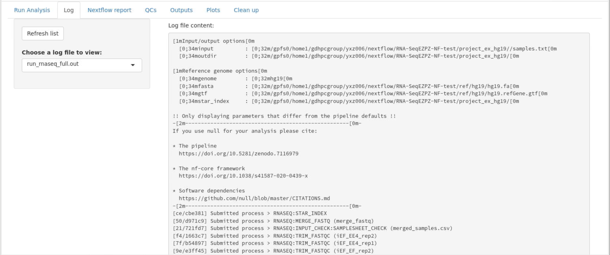

# RNA-SeqEZPZ: A Point-and-Click Pipeline for Comprehensive Transcriptomics Analysis with Interactive Visualizations
<br />
<br />

RNA-SeqEZPZ is a pipeline to run analysis of RNA-Seq experiments from raw FASTQ files all the way to differential genes analysis.
The pipeline is accessible through a graphical user interface implemented using a Shiny app and features interactive plots.
Advanced users have the ability to customize the scripts provided with the pipeline.
This pipeline is designed to run on an HPC cluster.
Please cite [[1]](#1) if you are using this pipeline for a publication.

<br />

## Installation
In order to use the pipeline, you will need to have Singularity installed in your HPC. See installation instruction at https://docs.sylabs.io/guides/3.0/user-guide/installation.html

The following step-by-step is for a system with SLURM scheduler and it will run bash scripts. If you need to run it on a different scheduler or if you prefer to use the Nextflow version of the pipeline, please go to https://github.com/yzhang18/RNA-SeqEZPZ-NF

1. Download the code/scripts:
   ```
   git clone https://github.com/cxtaslim/RNA-SeqEZPZ.git
   ```
   This step will copy all the required code into your local directory.
2. Change the SLURM setting to reflect your HPC settings in your local copy of 

   ```RNA-SeqEZPZ/scripts/slurm_config_var.sh```

4. Go to the ```RNA-SeqEZPZ``` directory and download the singularity image:
   ```
   # go to RNA-SeqEZPZ directory
   cd RNA-SeqEZPZ
   # download the singularity image and save as rnaseq-pipe-container.sif
   singularity pull --name rnaseq-pipe-container.sif library://cxtaslim/pipelines/rna-seqezpz:latest
   ```
   This step will copy a singularity image.
   Now, you have all the scripts and programs needed to run the entire RNA-Seq pipeline. 

## Downloading hg19 reference files
In order to run the pipeline, you will need to download reference files.
These are the steps to get **human hg19** references to run this pipeline. Following these steps will enable you to select hg19 genome in the graphical interface.
The tutorial below on running test dataset uses human hg19 so you need this to run the test dataset below.
1. Go to ```RNA-SeqEZPZ``` directory and create a ```ref/hg19``` directory. **Note**: foldername MUST be ```ref/hg19```

   ```
   # if you follow step 4 above, then you are already in RNA-SeqEZPZ directory
   # create a ref directory inside RNA-SeqEZPZ and a sub-directory called hg19 under ref
   mkdir -p ref/hg19
   ```
3. Go to the directory created in step 1 and download hg19 fasta file to this directory
   ```
   # go to RNA-SeqEZPZ/ref/hg19 directory
   cd ref/hg19
   # download and unzip the fasta file from UCSC genome browser
   wget -O - https://hgdownload.soe.ucsc.edu/goldenPath/hg19/bigZips/hg19.fa.gz | gunzip -c > hg19.fa
   ```
4. Download annotation file (.gtf)
   ```
   # download and unzip the gtf file from UCSC genome browser
   wget -O - https://hgdownload.soe.ucsc.edu/goldenPath/hg19/bigZips/genes/hg19.refGene.gtf.gz | gunzip -c > hg19.refGene.gtf
   ```
5. Optional. Download the chrom.sizes file. You can skip this and the pipeline will generate it for you as long as the ref folder is writable
   ```
   wget https://hgdownload.soe.ucsc.edu/goldenPath/hg19/bigZips/hg19.chrom.sizes
   ```
7. Now, you should have ```hg19.fa```, ```hg19.refGene.gtf``` and ```hg19.chrom.sizes``` inside ```RNA-SeqEZPZ/ref/hg19```
   ```
   # list the files
   ls -1
   ```
   The above command should show you the fasta, gtf and chrom.sizes files as shown below:
   ```
   ls -1
   hg19.chrom.sizes
   hg19.fa
   hg19.refGene.gtf
   ```
  
## Downloading hg38 reference files
These are the steps to get **human hg38** references to run this pipeline. Following these steps will enable you to select hg38 genome in the graphical interface.
You can skip this step if you are not going to use hg38 genome in the graphical interface.
1. Go to ```RNA-SeqEZPZ``` directory and create a ```ref/hg38``` directory. **Note**: foldername MUST be ```ref/hg38```
   ```
   # If you are following the steps above to get hg19 then you'd have to do the
   # following command to create RNA-SeqEZPZ/ref/hg38 folder
   mkdir -p ../hg38
   ```
3. Go to the directory created in step 1 and download hg38 fasta file to this directory
   ```
   # go to RNA-SeqEZPZ/ref/hg38 directory
   # if you are following the steps above you do the following command to go to hg38 directory
   cd ../hg38
   # download and unzip the fasta file from UCSC genome browser
   wget -O - https://hgdownload.soe.ucsc.edu/goldenPath/hg38/bigZips/hg38.fa.gz | gunzip -c > hg38.fa
   ```
4. Download annotation file (.gtf)
   ```
   # download and unzip the gtf file from UCSC genome browser
   wget -O - https://hgdownload.soe.ucsc.edu/goldenPath/hg38/bigZips/genes/hg38.refGene.gtf.gz  | gunzip -c > hg38.refGene.gtf
   ```
5. Optional. Download the chrom.sizes file. You can skip this and the pipeline will generate it for you as long as the ref folder is writable
   ```
   wget https://hgdownload.soe.ucsc.edu/goldenPath/hg38/bigZips/hg38.chrom.sizes
   ```
7. Now, you should have ```hg38.fa```, ```hg38.refGene.gtf``` and ```hg38.chrom.sizes``` inside ```RNA-SeqEZPZ/ref/hg38```
   ```
   # list the files
   ls -1
   ```
   The above command should show you the fasta, gtf and chrom.sizes files as shown below:
   ```
   ls -1
   hg38.chrom.sizes
   hg38.fa
   hg38.refGene.gtf
   ```

## Tips on downloading other references
1. Make sure both gtf and fasta files have the same chromosome names.
3. In order for pathway analysis to work, gtf file MUST contains gene symbols.
4. If you don't have ```chrom.sizes``` file for the genome, it will be created for you in the folder where the fasta file is.

## Running test dataset using hg19
1. To run the pipeline, if you haven't already, go to the ```RNA-SeqEZPZ``` directory that you cloned on the first step, run ```run_shiny_analysis.sh``` with filepath set to ```project_ex```.
   <br/>
   ***Note*** on ```filepath```: since you are using reference file downloaded following the steps above, you only need to set ```filepath``` to a location where FASTQ files and project directory
   are either in the specified path or within its subdirectories. See the section [Running your own dataset using zebrafish danRer11 genome](#running-your-own-dataset-using-zebrafish-danRer11-genome). 
   ```
   # go to RNA-SeqEZPZ folder
   # if you are currently in ref/hg38 folder following step 7 above, go up to RNA-SeqEZPZ folder
   cd ../..
   # run the user interface
   bash scripts/run_shiny_analysis.sh filepath=project_ex
   ``` 
   <br />
   A Firefox browser will be displayed that will enable you to run the full analysis.
   <br />  

   

3. In order to run the test dataset, first you will need to select project folder. 
   In this case, you would click on ```Select project folder```, a window will appear.
   Please click on ```root``` (make sure it is highlighted with blue background as pictured below) and click on ```Select``` button.
   You are clicking on ```root``` because you set your ```filepath``` to ```project_ex``` which is called root in this case.
   

   **Note**: If you selected the ```project folder``` successfully, under ```Select project folder``` you should see ```Click to load existing samples.txt``` button.
   
5. Next, you will need to fill out the form.
   Test dataset is a down-sampled of the public example dataset described in the manuscript. There are 6 samples:
   | fastq file name | description                                                                                               |
   | ----------------| ----------------------------------------------------------------------------------------------------------|
   | iEF714R1        | cells with knockdown of endogenous EWSR1::FLI1 followed by rescue with a EWSR1::FLI1 construct (714) replicate 1|
   | iEF714R2        | cells with knockdown of endogenous EWSR1::FLI1 followed by rescue with a EWSR1::FLI1 construct (714) replicate 2|
   | iEF563R1        | cells with knockdown of endogenous EWSR1::FLI1 followed by rescue with a EWSR1::ETV4 construct (563) replicate 1|
   | iEF563R2        | cells with knockdown of endogenous EWSR1::FLI1 followed by rescue with a EWSR1::ETV4 construct (563) replicate 2|
   | iEF197R1        | cells with knockdown of endogenous EWSR1::FLI1 followed by rescue with an empty vector (197) replicate 1        |
   | iEF197R2        | cells with knockdown of endogenous EWSR1::FLI1 followed by rescue with an empty vector (197) replicate 2        |
   
   The goal of the analysis is to find genes regulated by EWSR1::FLI1 and genes regulated by EWSR1::ETV4.
   Therefore, we are going to compare iEF714 which we will be our iEF_EF group with iEF_empty as control.
   We will also compare iEF563 which will be our iEF_EE4 group with iEF_empty as control.
   <br> In the form, we will have a total of 6 rows:
   * 2 rows for iEF_EF group since we have two replicates with iEF_empty as control
   * 2 rows for iEF_EE4 group since we have two replicates with iEF_empty as control
   * 2 rows for iEF_empty group since we have two replicates with NA as control. **Note** samples that will be used as control will have control name as NA.
   In each row, we need to select the \_R1_ and \_R2_ files for first-pair R1 fastq files and the second-pair R2 fastq files, respectively.
   
   This is what the filled form should look like:
   

   You can click on ```Click to load samples.txt``` to automatically fill out the form.

   **Note**: this step only works because there is an existing samples.txt in the ```project_ex``` directory that was provided for you.
      
6. At this point, you are ready to click on ```Run full analysis``` to run the entire RNA-Seq pipeline steps with the example datasets provided.

7. After clicking on ```Run full analysis```, you can click on ```Log``` then click on ```Refresh list``` to see the content of ```run_rnaseq_full.out```
   which contains the progress of the pipeline.
  
   In the screenshot above, the pipeline is currently doing trimming and performing quality control of reads.
   For more information, you can select ```run_trim_qc.out``` under ```Choose a log file to view:```
   Please review all the log files to make sure everything is correct.

8. When the entire pipeline is done, you can scroll down on ```run_rnaseq_full.out``` and see similar message as pictured below:
   
   **Note**: try ```Refresh list``` to view updated file.

9. Once full analysis is finished, you can click on ```QCs``` tab to see the Quality Control metrics generated.
   

10. You can also click on ```Outputs``` tab which  which contains differential genes analysis calculated by DESeq2 [[2]](#2) and statistical report generated by SARTools [[3]](#3) with modifications.

11. In the ```Plots``` tab, inserting another comparison group will show the overlap between the two groups of comparisons.
   In this case, it will compare the differential genes in iEF_EF vs iEF_empty with iEF_EE4 vs iEF_empty.
   

12. [project_ex_out](project_ex_out) contains all the outputs automatically generated by the pipeline.

Since test dataset provided is a small dataset that are provided to quickly test the installation of the pipeline, below we provided screenshots of the ```plots``` tab
which were done on the full example dataset to illustrate the analysis that can be done on ```RNA-SeqEZPZ```.

Example of table feature where you can search by gene name and get its log Fold-Change, mean of count difference, and whether it is significantly up-regulated, down-regulated or not significant (NS).
You can adjust the significance cut-offs then export the gene list with adjusted significance cut-offs.


Example of volcano plot where you can enter the official gene names to make that specific gene be highlighted in the volcano plots.


Example of overlaps of genes regulated by EWSR1::FLI1 (iEF_EF vs iEF_empty) with genes regulated by EWSR1::ETV4 (iEF_EE4 vs iEF_empty)


Example of upset plot showing overlaps of genes regulated by EWSR1::FLI1 (iEF_EF vs iEF_empty) with genes regulated by EWSR1::ETV4 (iEF_EE4 vs iEF_empty)


Example of pathway analysis genes down-/up-regulated by EWSR1::FLI1 (iEF_EF vs iEF_empty) and genes down-/up-regulated by EWSR1::ETV4 (iEF_EE4 vs iEF_empty)


### Running your own dataset using zebrafish danRer11 genome.
You would need to download zebrafish references and have your FASTQ files and project folder where you would save all the outputs under the same parent directory.
When running the pipeline, you would then set the filepath to the parent directory. See example below.

1. For example, in the following setting, you will put your references, fastq files and project folder in a folder under ```RNA-SeqEZPZ```
   ```
   # if you follow the steps to run test dataset, you can create ```RNA-SeqEZPZ/ref/danRer11``` with the following command
   mkdir -p ref/danRer11
   # go to danRer11 folder and download the reference files
   cd ref/danRer11
   wget -O - https://hgdownload.soe.ucsc.edu/goldenPath/danRer11/bigZips/danRer11.fa.gz | gunzip -c > danRer11.fa
   wget -O - https://hgdownload.soe.ucsc.edu/goldenPath/danRer11/bigZips/genes/danRer11.refGene.gtf.gz  | gunzip -c > danRer11.refGene.gtf
   wget https://hgdownload.soe.ucsc.edu/goldenPath/danRer11/bigZips/danRer11.chrom.sizes
   ```
2. You would need to put your FASTQ files in directory under ```RNA-SeqEZPZ```. For example ```RNA-SeqEZPZ/raw_data/fastq```.
3. Go to ```RNA-SeqEZPZ``` folder and run ```run_shiny_analysis.sh``` with filepath that contains both FASTQ, reference fasta, gtf files and also where you want to save your analysis.
   
   In this example, since your FASTQ files are inside ```RNA-SeqEZPZ/raw_data/fastq```, your reference are inside ```RNA-SeqEZPZ/ref``` and you want to save your analysis under the ```RNA-SeqEZPZ``` folder, you can set filepath to where your RNA-SeqEZPZ is.
   Assuming you are in RNA-SeqEZPZ folder, you can simply specify ```filepath=.```. The dot means setting filepath to the current folder.
   ``` 
   # if you are currently in RNA-SeqEZPZ/ref/danRer11 folder following step 1 of running your own dataset,
   # you have to go up twice to go to RNA-SeqEZPZ folder
   cd ../..
   bash scripts/run_shiny_analysis.sh filepath=.
   ```
   **Note**: options for ```run_shiny_analysis.sh```:
      - If needed you can also set the time=DD-HH:MM:SS. (Day-hours:minutes:seconds). This is usually needed when your HPC is reserved for maintenance.
      - If you have more than 50 FASTQ files that you need to analyze, you would need to set max_nsamples=<number-of-FASTQ-files> option.
      - You can also run it with run=debug option to get more messages when trouble shooting.
      - example of command with time set to 1 day 12 hours 30 minutes and 40 seconds, filepath set to current folder, run=debug and maximum number of FASTQ files set to 100:
         ```
         bash scripts/run_shiny_analysis.sh filepath=. time=1-12:30:40 max_nsamples=100 run=debug
         ```
              
      <br />
      A Firefox browser will be displayed that will enable you to run the full analysis.
      <br />  

      

   4. You will need to select project folder. 
      In this case, you would click on ```Select project folder```, a window will appear.
      You can create new folder and specified the folder name in the interface.
      Click on ```Create new folder``` after clicking on root, it will allow you to put in name for the new folder.
      Once you click on the plus sign, it will create the named folder under root which is RNA-SeqEZPZ.
      In this example, I am creating a folder named ```my_project```
      
      You will need to click on my_project and click ```select``` at the bottom right to select my_project as your project folder.
      After clicking ```select```, you should see my_project under ```Select project folder``` button.
      

   5. Select your genome. If you are using genome that is neither hg19 or hg38, select ```other```.
   6. Type in your genome name. In this case, I'm going to type in ```danRer11```.
   7. Select your genome fasta file and genome GTF file you downloaded in step 1.
   
   8. Fill out the form. See step 3 for running test example to fill out the form for your own dataset.
   9. Once you're done filling out the form, you can click on ```Run full analysis``` to run the entire pipeline.
   
Feel free to open an issue for any questions or problems.

## References
<a id="1">[1]</a>
Taslim, C., Yuan, Z., Kendall, G.C. & Theisen, E.R. RNA-SeqEzPZ: A Point-and-Click Pipeline for Comprehensive Transcriptomics Analysis with Interactive Visualizations. Submitted.

<a id="2">[2]</a>
Love, M.I., Huber, W. & Anders, S. Moderated estimation of fold change and dispersion for RNA-seq data with DESeq2. Genome Biol 15, 550 (2014). https://doi.org/10.1186/s13059-014-0550-8

<a id="3">[3]</a>
SARTools: A DESeq2- and EdgeR-Based R Pipeline for Comprehensive Differential Analysis of RNA-Seq Data
Varet H, Brillet-Guéguen L, Coppée JY, Dillies MA (2016) SARTools: A DESeq2- and EdgeR-Based R Pipeline for Comprehensive Differential Analysis of RNA-Seq Data. PLOS ONE 11(6): e0157022. https://doi.org/10.1371/journal.pone.0157022


# RNA-SeqEZPZ: A Point-and-Click Pipeline for Comprehensive Transcriptomics Analysis with Interactive Visualizations
<br />
<br />

RNA-SeqEZPZ is a pipeline to run analysis of RNA-Seq experiments from raw FASTQ files all the way to differential genes analysis.
The pipeline is accessible through a graphical user interface implemented using a Shiny app and features interactive plots.
Advanced users have the ability to customize the scripts provided with the pipeline.
This pipeline is designed to run on an HPC cluster.
Please cite [[1]](#1) if you are using this pipeline for a publication.

<br />

## Installation
In order to use the pipeline, you will need to have Singularity installed in your HPC. See installation instruction at https://docs.sylabs.io/guides/3.0/user-guide/installation.html

The following step-by-step is for a system with SLURM scheduler and it will run bash scripts. If you need to run it on a different scheduler or if you prefer to use the Nextflow version of the pipeline, please go to https://github.com/yzhang18/RNA-SeqEZPZ-NF

1. Download the code/scripts:
   ```
   git clone https://github.com/cxtaslim/RNA-SeqEZPZ.git
   ```
   This step will copy all the required code into your local directory.
2. Change the SLURM setting to reflect your HPC settings in your local copy of 

   ```RNA-SeqEZPZ/scripts/slurm_config_var.sh```

4. Go to the ```RNA-SeqEZPZ``` directory and download the singularity image:
   ```
   # go to RNA-SeqEZPZ directory
   cd RNA-SeqEZPZ
   # download the singularity image and save as rnaseq-pipe-container.sif
   singularity pull --name rnaseq-pipe-container.sif library://cxtaslim/pipelines/rna-seqezpz:latest
   ```
   This step will copy a singularity image.
   Now, you have all the scripts and programs needed to run the entire RNA-Seq pipeline. 

## Downloading hg19 reference files
In order to run the pipeline, you will need to download reference files.
These are the steps to get **human hg19** references to run this pipeline. Following these steps will enable you to select hg19 genome in the graphical interface.
1. Go to ```RNA-SeqEZPZ``` directory and create a ```ref/hg19``` directory. **Note**: foldername MUST be ```ref/hg19```

   ```
   # if you follow step 4 above, then you are already in RNA-SeqEZPZ directory
   # create a ref directory inside RNA-SeqEZPZ and a sub-directory called hg19 under ref
   mkdir -p ref/hg19
   ```
3. Go to the directory created in step 1 and download hg19 fasta file to this directory
   ```
   # go to RNA-SeqEZPZ/ref/hg19 directory
   cd ref/hg19
   # download and unzip the fasta file from UCSC genome browser
   wget -O - https://hgdownload.soe.ucsc.edu/goldenPath/hg19/bigZips/hg19.fa.gz | gunzip -c > hg19.fa
   ```
4. Download annotation file (.gtf)
   ```
   # download and unzip the gtf file from UCSC genome browser
   wget -O - https://hgdownload.soe.ucsc.edu/goldenPath/hg19/bigZips/genes/hg19.refGene.gtf.gz | gunzip -c > hg19.refGene.gtf
   ```
5. Optional. Download the chrom.sizes file. You can skip this and the pipeline will generate it for you as long as the ref folder is writable
   ```
   wget https://hgdownload.soe.ucsc.edu/goldenPath/hg19/bigZips/hg19.chrom.sizes
   ```
7. Now, you should have ```hg19.fa```, ```hg19.refGene.gtf``` and ```hg19.chrom.sizes``` inside ```RNA-SeqEZPZ/ref/hg19```
   ```
   # list the files
   ls -1
   ```
   The above command should show you the fasta, gtf and chrom.sizes files as shown below:
   ```
   ls -1
   hg19.chrom.sizes
   hg19.fa
   hg19.refGene.gtf
   ```
  
## Downloading hg38 reference files
These are the steps to get **human hg38** references to run this pipeline. Following these steps will enable you to select hg38 genome in the graphical interface.
You can skip this step if you are not going to use hg38 genome in the graphical interface.
1. Go to ```RNA-SeqEZPZ``` directory and create a ```ref/hg38``` directory. **Note**: foldername MUST be ```ref/hg38```
   ```
   # If you are following the steps above to get hg19 then you'd have to do the
   # following command to create RNA-SeqEZPZ/ref/hg38 folder
   mkdir -p ../hg38
   ```
3. Go to the directory created in step 1 and download hg38 fasta file to this directory
   ```
   # go to RNA-SeqEZPZ/ref/hg38 directory
   # if you are following the steps above you do the following command to go to hg38 directory
   cd ../hg38
   # download and unzip the fasta file from UCSC genome browser
   wget -O - https://hgdownload.soe.ucsc.edu/goldenPath/hg38/bigZips/hg38.fa.gz | gunzip -c > hg38.fa
   ```
4. Download annotation file (.gtf)
   ```
   # download and unzip the gtf file from UCSC genome browser
   wget -O - https://hgdownload.soe.ucsc.edu/goldenPath/hg38/bigZips/genes/hg38.refGene.gtf.gz  | gunzip -c > hg38.refGene.gtf
   ```
5. Optional. Download the chrom.sizes file. You can skip this and the pipeline will generate it for you as long as the ref folder is writable
   ```
   wget https://hgdownload.soe.ucsc.edu/goldenPath/hg38/bigZips/hg38.chrom.sizes
   ```
7. Now, you should have ```hg38.fa```, ```hg38.refGene.gtf``` and ```hg38.chrom.sizes``` inside ```RNA-SeqEZPZ/ref/hg38```
   ```
   # list the files
   ls -1
   ```
   The above command should show you the fasta, gtf and chrom.sizes files as shown below:
   ```
   ls -1
   hg38.chrom.sizes
   hg38.fa
   hg38.refGene.gtf
   ```

## Tips on downloading other references
1. Make sure both gtf and fasta files have the same chromosome names.
3. In order for pathway analysis to work, gtf file MUST contains gene symbols.
4. If you don't have ```chrom.sizes``` file for the genome, it will be created for you in the folder where the fasta file is.

## Running test dataset using hg19
1. To run the pipeline, if you haven't already, go to the ```RNA-SeqEZPZ``` directory that you cloned on the first step, run run_shiny_analysis.sh with filepath set to ```project_ex```:
```
   # go to RNA-SeqEZPZ folder
   # if you are currently in ref/hg38 folder following step 7 above, go up to RNA-SeqEZPZ folder
   cd ../..
   # run the user interface
   bash scripts/run_shiny_analysis.sh filepath=project_ex
   ``` 
   <br />
   A Firefox browser will be displayed that will enable you to run the full analysis.
   <br />  

   

2. In order to run the test dataset, first you will need to select project folder. 
   In this case, you would click on ```Select project folder```, a window will appear.
   Please click on ```root``` (make sure it is highlighted with blue background as pictured below) and click on ```Select``` button.
   

   **Note**: If you selected the ```project folder``` successfully, under ```Select project folder``` you should see ```Click to load existing samples.txt``` button.
   
3. Next, you will need to fill out the form.
   Test dataset is a down-sampled of the public example dataset described in the manuscript. There are 6 samples:
   | fastq file name | description                                                                                               |
   | ----------------| ----------------------------------------------------------------------------------------------------------|
   | iEF714R1        | cells with knockdown of endogenous EWSR1::FLI1 followed by rescue with a EWSR1::FLI1 construct (714) replicate 1|
   | iEF714R2        | cells with knockdown of endogenous EWSR1::FLI1 followed by rescue with a EWSR1::FLI1 construct (714) replicate 2|
   | iEF563R1        | cells with knockdown of endogenous EWSR1::FLI1 followed by rescue with a EWSR1::ETV4 construct (563) replicate 1|
   | iEF563R2        | cells with knockdown of endogenous EWSR1::FLI1 followed by rescue with a EWSR1::ETV4 construct (563) replicate 2|
   | iEF197R1        | cells with knockdown of endogenous EWSR1::FLI1 followed by rescue with an empty vector (197) replicate 1        |
   | iEF197R2        | cells with knockdown of endogenous EWSR1::FLI1 followed by rescue with an empty vector (197) replicate 2        |
   
   The goal of the analysis is to find genes regulated by EWSR1::FLI1 and genes regulated by EWSR1::ETV4.
   Therefore, we are going to compare iEF714 which we will be our iEF_EF group with iEF_empty as control.
   We will also compare iEF563 which will be our iEF_EE4 group with iEF_empty as control.
   <br> In the form, we will have a total of 6 rows:
   * 2 rows for iEF_EF group since we have two replicates with iEF_empty as control
   * 2 rows for iEF_EE4 group since we have two replicates with iEF_empty as control
   * 2 rows for iEF_empty group since we have two replicates with NA as control. **Note** samples that will be used as control will have control name as NA.
   In each row, we need to select the \_R1_ and \_R2_ files for first-pair R1 fastq files and the second-pair R2 fastq files, respectively.
   
   This is what the filled form should look like:
   

   You can click on ```Click to load samples.txt``` to automatically fill out the form.

   **Note**: this step only works because there is an existing samples.txt in the ```project_ex``` directory that was provided for you.
      
5. At this point, you are ready to click on ```Run full analysis``` to run the entire RNA-Seq pipeline steps with the example datasets provided.

6. After clicking on ```Run full analysis```, you can click on ```Log``` then click on ```Refresh list``` to see the content of ```run_rnaseq_full.out```
   which contains the progress of the pipeline.
  
   In the screenshot above, the pipeline is currently doing trimming and performing quality control of reads.
   For more information, you can select ```run_trim_qc.out``` under ```Choose a log file to view:```
   Please review all the log files to make sure everything is correct.

8. When the entire pipeline is done, you can scroll down on ```run_rnaseq_full.out``` and see similar message as pictured below:
   
   **Note**: try ```Refresh list``` to view updated file.

9. Once full analysis is finished, you can click on ```QCs``` tab to see the Quality Control metrics generated.
   

10. You can also click on ```Outputs``` tab which  which contains differential genes analysis calculated by DESeq2 [[2]](#2) and statistical report generated by SARTools [[3]](#3) with modifications.

11. In the ```Plots``` tab, inserting another comparison group will show the overlap between the two groups of comparisons.
   In this case, it will compare the differential genes in iEF_EF vs iEF_empty with iEF_EE4 vs iEF_empty.
   

12. [project_ex_out](project_ex_out) contains all the outputs automatically generated by the pipeline.

Since test dataset provided is a small dataset that are provided to quickly test the installation of the pipeline, below we provided screenshots of the ```plots``` tab
which were done on the full example dataset to illustrate the analysis that can be done on ```RNA-SeqEZPZ```.

Example of table feature where you can search by gene name and get its log Fold-Change, mean of count difference, and whether it is significantly up-regulated, down-regulated or not significant (NS).
You can adjust the significance cut-offs then export the gene list with adjusted significance cut-offs.


Example of volcano plot where you can enter the official gene names to make that specific gene be highlighted in the volcano plots.


Example of overlaps of genes regulated by EWSR1::FLI1 (iEF_EF vs iEF_empty) with genes regulated by EWSR1::ETV4 (iEF_EE4 vs iEF_empty)


Example of upset plot showing overlaps of genes regulated by EWSR1::FLI1 (iEF_EF vs iEF_empty) with genes regulated by EWSR1::ETV4 (iEF_EE4 vs iEF_empty)


Example of pathway analysis genes down-/up-regulated by EWSR1::FLI1 (iEF_EF vs iEF_empty) and genes down-/up-regulated by EWSR1::ETV4 (iEF_EE4 vs iEF_empty)


## Running your own dataset using zebrafish danRer11 genome.
You would need to download zebrafish references and have your FASTQ files and project folder where you would save all the outputs under the same parent directory.
When running the pipeline, you would then set the filepath to the parent directory. See example below.

1. For example, in the following setting, you will put your references, fastq files and project folder in a folder under ```RNA-SeqEZPZ```
   ```
   # if you follow the steps to run test dataset, you can create ```RNA-SeqEZPZ/ref/danRer11``` with the following command
   mkdir -p ref/danRer11
   # go to danRer11 folder and download the reference files
   cd ref/danRer11
   wget -O - https://hgdownload.soe.ucsc.edu/goldenPath/danRer11/bigZips/danRer11.fa.gz | gunzip -c > danRer11.fa
   wget -O - https://hgdownload.soe.ucsc.edu/goldenPath/danRer11/bigZips/genes/danRer11.refGene.gtf.gz  | gunzip -c > danRer11.refGene.gtf
   wget https://hgdownload.soe.ucsc.edu/goldenPath/danRer11/bigZips/danRer11.chrom.sizes
   ```
2. You would need to put your FASTQ files in directory under ```RNA-SeqEZPZ```. For example ```RNA-SeqEZPZ/raw_data/fastq```.
3. Go to ```RNA-SeqEZPZ``` folder and run ```run_shiny_analysis.sh``` with filepath that contains both FASTQ, reference fasta, gtf files and also where you want to save your analysis.
   
   In this example, since your FASTQ files are inside ```RNA-SeqEZPZ/raw_data/fastq```, your reference are inside ```RNA-SeqEZPZ/ref``` and you want to save your analysis under the ```RNA-SeqEZPZ``` folder, you can set filepath to where your RNA-SeqEZPZ is.
   Assuming you are in RNA-SeqEZPZ folder, you can simply specify ```filepath=.```. The dot means setting filepath to the current folder.
   ``` 
   # if you are currently in RNA-SeqEZPZ/ref/danRer11 folder following step 1 of running your own dataset,
   # you have to go up twice to go to RNA-SeqEZPZ folder
   cd ../..
   bash scripts/run_shiny_analysis.sh filepath=.
   ```
   **Note**: options for ```run_shiny_analysis.sh```:
      - If needed you can also set the time=DD-HH:MM:SS. (Day-hours:minutes:seconds). This is usually needed when your HPC is reserved for maintenance.
      - If you have more than 50 FASTQ files that you need to analyze, you would need to set max_nsamples=<number-of-FASTQ-files> option.
      - You can also run it with run=debug option to get more messages when trouble shooting.
      - example of command with time set to 1 day 12 hours 30 minutes and 40 seconds, filepath set to current folder, run=debug and maximum number of FASTQ files set to 100:
         ```
         bash scripts/run_shiny_analysis.sh filepath=. time=1-12:30:40 max_nsamples=100 run=debug
         ```
              
      <br />
      A Firefox browser will be displayed that will enable you to run the full analysis.
      <br />  

      

   4. You will need to select project folder. 
      In this case, you would click on ```Select project folder```, a window will appear.
      You can create new folder and specified the folder name in the interface.
      Click on ```Create new folder``` after clicking on root, it will allow you to put in name for the new folder.
      Once you click on the plus sign, it will create the named folder under root which is RNA-SeqEZPZ.
      In this example, I am creating a folder named ```my_project```
      
      You will need to click on my_project and click ```select``` at the bottom right to select my_project as your project folder.
      After clicking ```select```, you should see my_project under ```Select project folder``` button.
      

   5. Select your genome. If you are using genome that is neither hg19 or hg38, select ```other```.
   6. Type in your genome name. In this case, I'm going to type in ```danRer11```.
   7. Select your genome fasta file and genome GTF file you downloaded in step 1.
   
   8. Fill out the form. See step 3 for running test example to fill out the form for your own dataset.
   9. Once you're done filling out the form, you can click on ```Run full analysis``` to run the entire pipeline.
   
Feel free to open an issue for any questions or problems.

## References
<a id="1">[1]</a>
Taslim, C., Yuan, Z., Kendall, G.C. & Theisen, E.R. RNA-SeqEzPZ: A Point-and-Click Pipeline for Comprehensive Transcriptomics Analysis with Interactive Visualizations. Submitted.

<a id="2">[2]</a>
Love, M.I., Huber, W. & Anders, S. Moderated estimation of fold change and dispersion for RNA-seq data with DESeq2. Genome Biol 15, 550 (2014). https://doi.org/10.1186/s13059-014-0550-8

<a id="3">[3]</a>
SARTools: A DESeq2- and EdgeR-Based R Pipeline for Comprehensive Differential Analysis of RNA-Seq Data
Varet H, Brillet-Guéguen L, Coppée JY, Dillies MA (2016) SARTools: A DESeq2- and EdgeR-Based R Pipeline for Comprehensive Differential Analysis of RNA-Seq Data. PLOS ONE 11(6): e0157022. https://doi.org/10.1371/journal.pone.0157022


