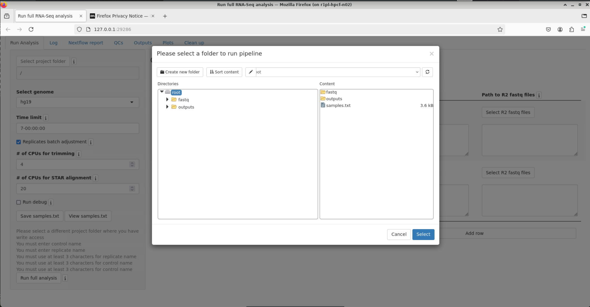

# RNA-SeqEZPZ-NF
## Nextflow Pipeline for RNA-SeqEZPZ 
### A Point-and-Click Pipeline for Comprehensive Transcriptomics Analysis with Interactive Visualizations
<br />
<br />

RNA-SeqEZPZ-NF is another implementation of [RNA-SeqEZPZ](https://github.com/cxtaslim/RNA-SeqEZPZ). RNA-SeqEZPZ-NF uses the same user interface as RNA-SeqEZPZ and runs the same pipeline, but runs the pipeline implemented by [Nextflow](https://www.nextflow.io/). This pipeline is currently tested on HPC cluster with SLURM scheduler. Advanced users have the ability to customize the scripts to run with other schedulers.

<br />

## Installation
This pipeline uses Singularity image and Nextflow, which should make it easy to setup. However, the initial setup can sometimes be tricky. Please do not hesitate to create a new issue if you need help with installation or setup.

In order to use the pipeline, you will need to have Singularity and Nextflow installed in your HPC. See installation instructions at https://docs.sylabs.io/guides/3.0/user-guide/installation.html and https://www.nextflow.io/docs/latest/install.html

The following step-by-step is for a system with SLURM scheduler, Singularity and Nextflow. If you'd like to use the version of the pipeline without Nextflow, please go to [https://github.com/cxtaslim/RNA-SeqEZPZ](https://github.com/cxtaslim/RNA-SeqEZPZ)

1. Download the code/scripts:
   ```
   git clone https://github.com/yzhang18/RNA-SeqEZPZ-NF.git
   ```
   This step will copy all the required code into your local directory.
2. There are three files that you can make changes to reflect the settings in your local copy of the code.

   ```
   RNA-SeqEZPZ-NF/main.nf  ## Set up your input, output, genome file, gtf file, etc..
   RNA-SeqEZPZ-NF/scripts/nextflow_config_var.config  ## Set up the variables for your local scheduler.
   RNA-SeqEZPZ-NF/project_ex/nextflow.config  ## Set up the resource limit for processes. This is optional, since most parameters are set up in RNA-Seq-EZPZ-NF/nextflow.config, which is generated automatically by the pipeline. 
   ```

4. Go to the ```RNA-SeqEZPZ-NF``` directory and download the singularity image:
   ```
   # go to RNA-SeqEZPZ-NF directory
   cd RNA-SeqEZPZ-NF
   # download the singularity image and save as rnaseq-pipe-container.sif
   singularity pull --name rnaseq-pipe-container.sif library://cxtaslim/pipelines/rna-seqezpz:latest
   ```
   This step will copy a singularity image.
   Now, you have all the scripts and programs needed to run the entire RNA-Seq pipeline. 

## Downloading hg19 reference files
In order to run the pipeline, you will need to download reference files.
These are the steps to get **human hg19** references to run this pipeline. Following these steps will enable you to select hg19 genome in the graphical interface.
1. Go to ```RNA-SeqEZPZ-NF``` directory and create a ```ref/hg19``` directory. **Note**: foldername MUST be ```ref/hg19```
   ```
   # go to RNA-SeqEZPZ-NF directory. Only do this if you haven't done "cd RNA-SeqEZPZ" before
   cd RNA-SeqEZPZ-NF
   # create a ref directory inside RNA-SeqEZPZ-NF and a sub-directory called hg19 under ref
   mkdir -p ref/hg19
   ```
3. Go to the directory created in step 1 and download hg19 fasta file to this directory
   ```
   # go to RNA-SeqEZPZ-NF/ref/hg19 directory
   cd ref/hg19
   # download and unzip the fasta file from UCSC genome browser
   wget -O - https://hgdownload.soe.ucsc.edu/goldenPath/hg19/bigZips/hg19.fa.gz | gunzip -c > hg19.fa
   ```
4. Download annotation file (.gtf)
   ```
   # download and unzip the gtf file from UCSC genome browser
   wget -O - https://hgdownload.soe.ucsc.edu/goldenPath/hg19/bigZips/genes/hg19.refGene.gtf.gz | gunzip -c > hg19.refGene.gtf
   ```
5. Optional. Download the chrom.sizes file. You can skip this and the pipeline will generate it for you as long as the ref folder is writable
   ```
   wget https://hgdownload.soe.ucsc.edu/goldenPath/hg19/bigZips/hg19.chrom.sizes
   ```
7. Now, you should have ```hg19.fa```, ```hg19.refGene.gtf``` and ```hg19.chrom.sizes``` inside ```RNA-SeqEZPZ/ref/hg19```
   ```
   # list the files
   ls -1
   ```
   The above command should show you the fasta, gtf and chrom.sizes files as shown below:
   ```
   ls -1
   hg19.chrom.sizes
   hg19.fa
   hg19.refGene.gtf
   ```
   
## Downloading hg38 reference files
These are the steps to get **human hg38** references to run this pipeline. Following these steps will enable you to select hg38 genome in the graphical interface.
You can skip this step if you are not going to use hg38 genome in the graphical interface.
1. Go to ```RNA-SeqEZPZ-NF``` directory and create a ```ref/hg38``` directory. **Note**: foldername MUST be ```ref/hg38```
   ```
   # create RNA-SeqEZPZ-NF/ref/hg38 folder. If you are following the steps above to get hg19 then you'd have to do the
   # following command to create RNA-SeqEZPZ-NF/ref/hg38
   mkdir -p ../hg38
   ```
3. Go to the directory created in step 1 and download hg38 fasta file to this directory
   ```
   # go to RNA-SeqEZPZ-NF/ref/hg38 directory
   cd ../hg38
   # download and unzip the fasta file from UCSC genome browser
   wget -O - https://hgdownload.soe.ucsc.edu/goldenPath/hg38/bigZips/hg38.fa.gz | gunzip -c > hg38.fa
   ```
4. Download annotation file (.gtf)
   ```
   # download and unzip the gtf file from UCSC genome browser
   wget -O - https://hgdownload.soe.ucsc.edu/goldenPath/hg38/bigZips/genes/hg38.refGene.gtf.gz  | gunzip -c > hg38.refGene.gtf
   ```
5. Optional. Download the chrom.sizes file. You can skip this and the pipeline will generate it for you as long as the ref folder is writable
   ```
   wget https://hgdownload.soe.ucsc.edu/goldenPath/hg38/bigZips/hg38.chrom.sizes
   ```
7. Now, you should have ```hg38.fa```, ```hg38.refGene.gtf``` and ```hg38.chrom.sizes``` inside ```RNA-SeqEZPZ/ref/hg38```
   ```
   # list the files
   ls -1
   ```
   The above command should show you the fasta, gtf and chrom.sizes files as shown below:
   ```
   ls -1
   hg38.chrom.sizes
   hg38.fa
   hg38.refGene.gtf
   ```

## Tips on downloading other references
1. Make sure both gtf and fasta files have the same chromosome names.
3. In order for pathway analysis to work, gtf file MUST contains gene symbols.
4. Please place the fasta file inside a folder with ```<genome_name>```.
5. If you don't have ```chrom.sizes``` file for the genome, you need to make the folder ```<genome_name>``` writable.
   On the first run, ```chrom.sizes``` file will be created by the pipeline.

## Running test dataset with hg19 genome
1. To run the pipeline, if you haven't already, go to the ```RNA-SeqEZPZ-NF``` directory that you cloned on the first step, run run_shiny_analysis.sh with filepath set to ```project_ex```:
```
   # go to RNA-SeqEZPZ-NF folder
   # if you are currently in ref/hg19 folder go up to RNA-SeqEZPZ-NF folder
   cd ../..
   # run the user interface
   bash scripts/run_shiny_analysis.sh filepath=project_ex
   ``` 
   <br />
   A Firefox browser will be displayed that will enable you to run the full analysis.
   <br />  

   

2. In order to run the test dataset, first you will need to select project folder. 
   In this case, you would click on ```Select project folder```, a window will appear.
   Please click on ```root``` (make sure it is highlighted with blue background as pictured below) and click on ```Select``` button.
   

   **Note**: If you selected the ```project folder``` successfully, under ```Select project folder``` you should see ```Click to load existing samples.txt``` button.
   
3. Next, you will need to fill out the form.
   Test dataset is a down-sampled of the public example dataset described in the manuscript. There are 6 samples:
   | fastq file name | description                                                                                               |
   | ----------------| ----------------------------------------------------------------------------------------------------------|
   | iEF714R1        | cells with knockdown of endogenous EWSR1::FLI1 followed by rescue with a EWSR1::FLI1 construct (714) replicate 1|
   | iEF714R2        | cells with knockdown of endogenous EWSR1::FLI1 followed by rescue with a EWSR1::FLI1 construct (714) replicate 2|
   | iEF563R1        | cells with knockdown of endogenous EWSR1::FLI1 followed by rescue with a EWSR1::ETV4 construct (563) replicate 1|
   | iEF563R2        | cells with knockdown of endogenous EWSR1::FLI1 followed by rescue with a EWSR1::ETV4 construct (563) replicate 2|
   | iEF197R1        | cells with knockdown of endogenous EWSR1::FLI1 followed by rescue with an empty vector (197) replicate 1        |
   | iEF197R2        | cells with knockdown of endogenous EWSR1::FLI1 followed by rescue with an empty vector (197) replicate 2        |
   
   The goal of the analysis is to find genes regulated by EWSR1::FLI1 and genes regulated by EWSR1::ETV4.
   Therefore, we are going to compare iEF714 which we will be our iEF_EF group with iEF_empty as control.
   We will also compare iEF563 which will be our iEF_EE4 group with iEF_empty as control.
   <br> In the form, we will have a total of 6 rows:
   * 2 rows for iEF_EF group since we have two replicates with iEF_empty as control
   * 2 rows for iEF_EE4 group since we have two replicates with iEF_empty as control
   * 2 rows for iEF_empty group since we have two replicates with NA as control. **Note** samples that will be used as control will have control name as NA.
   In each row, we need to select the \_R1_ and \_R2_ files for first-pair R1 fastq files and the second-pair R2 fastq files, respectively.
   
   This is what the filled form should look like:
   

   You can click on ```Click to load samples.txt``` to automatically fill out the form.

   **Note**: this step only works because there is an existing samples.txt in the ```project_ex``` directory that was provided for you.
      
4. At this point, you are ready to click on ```Run full analysis``` to run the entire RNA-Seq pipeline steps with the example datasets provided.

5. After clicking on ```Run full analysis```, you can click on ```Log``` then click on ```Refresh list``` to see the content of ```run_rnaseq_full.out```
   which contains the progress of the pipeline.
  
   In the screenshot above, the pipeline is currently doing trimming and performing quality control of reads.
   For more information, you can select the log file for a run, e.g. ```trim_fastqc_iEF_EE4_rep2.out``` under ```Choose a log file to view:```
  

7. When the entire pipeline is done, you can scroll down on ```run_rnaseq_full.out``` and see similar message as pictured below:
   
   **Note**: try ```Refresh list``` to view updated file.

8. Once full analysis is finished, you can click on ```QCs``` tab to see the Quality Control metrics generated.
   

9. You can also click on ```Outputs``` tab which contains differential genes analysis calculated by DESeq2 [[2]](#2) and statistical report generated by SARTools [[3]](#3) with modifications.

10. In the ```Plots``` tab, inserting another comparison group will show the overlap between the two groups of comparisons.
   In this case, it will compare the differential genes in iEF_EF vs iEF_empty with iEF_EE4 vs iEF_empty.
   

11. [project_ex/outputs](project_ex/outputs) contains all the outputs automatically generated by the pipeline.

Since test dataset provided is a small dataset that are provided to quickly test the installation of the pipeline, below we provided screenshots of the ```plots``` tab
which were done on the full example dataset to illustrate the analysis that can be done on ```RNA-SeqEZPZ-NF```.

Example of table feature where you can search by gene name and get its log Fold-Change, mean of count difference, and whether it is significantly up-regulated, down-regulated or not significant (NS).
You can adjust the significance cut-offs then export the gene list with adjusted significance cut-offs.


Example of volcano plot where you can enter the official gene names to make that specific gene be highlighted in the volcano plots.


Example of overlaps of genes regulated by EWSR1::FLI1 (iEF_EF vs iEF_empty) with genes regulated by EWSR1::ETV4 (iEF_EE4 vs iEF_empty)


Example of upset plot showing overlaps of genes regulated by EWSR1::FLI1 (iEF_EF vs iEF_empty) with genes regulated by EWSR1::ETV4 (iEF_EE4 vs iEF_empty)


Example of pathway analysis genes down-/up-regulated by EWSR1::FLI1 (iEF_EF vs iEF_empty) and genes down-/up-regulated by EWSR1::ETV4 (iEF_EE4 vs iEF_empty)


11. The pipeline also provides a "Nextflow Pipeline Report" after the pipeline is completed. It provides information about the resource utilization of the whole pipeline and each step. This report is useful for tuning the requested resources for each step. 


## References

<a id="2">[2]</a>
Love, M.I., Huber, W. & Anders, S. Moderated estimation of fold change and dispersion for RNA-seq data with DESeq2. Genome Biol 15, 550 (2014). https://doi.org/10.1186/s13059-014-0550-8

<a id="3">[3]</a>
SARTools: A DESeq2- and EdgeR-Based R Pipeline for Comprehensive Differential Analysis of RNA-Seq Data
Varet H, Brillet-Guéguen L, Coppée JY, Dillies MA (2016) SARTools: A DESeq2- and EdgeR-Based R Pipeline for Comprehensive Differential Analysis of RNA-Seq Data. PLOS ONE 11(6): e0157022. https://doi.org/10.1371/journal.pone.0157022


